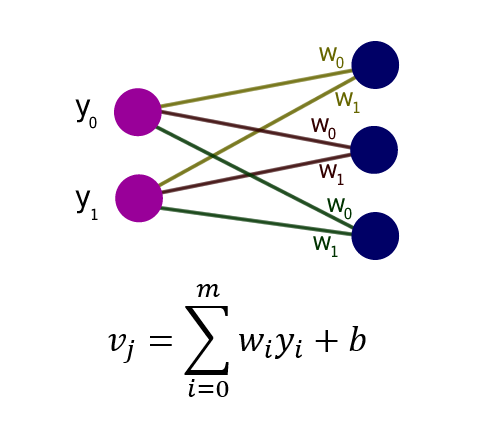

## Anotações
> A forma de One-Hot mudou:

* Antes: Tensorflow 1.x
 ``` ipython
 mnist = input_data.read_data_sets('MNIST_data/', one_hot=True) 
 ```

* Depois: Tensorflow 2.x

``` ipython

import tensorflow as tf
from tensorflow.keras.datasets import mnist

(treino_img, treino_lables), (teste_img, teste_lables) = mnist.load_data()

## Normalizando dados 
# intervalo [0, 1]

treino_img = treino_img / 255.0
teste_img = teste_img / 255.0

numero_classes = 10

# codificando rótulos
treino_labels_one_hot = tf.one_hot(treino_labels, num_classes)
teste_labels_one_hot = tf.one_hot(teste_labels, num_classes)

```

 
> No contexto do TensorFlow, o valor None é utilizado para representar uma dimensão flexível em um tensor. Quando você define um placeholder com None em uma dimensão específica, isso significa que o modelo pode lidar com diferentes tamanhos de lote (batch sizes) para aquele placeholder durante a execução.

<p> Essa idéia exemplifica isso </p>




```ipython
vj = tf.nn.relu(tf.add(tf.matmul(x, w1), b1))
```